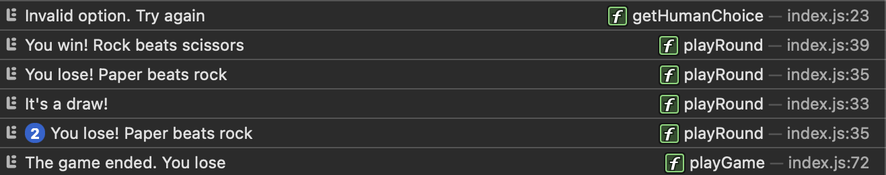

# Rock Paper Scissors

This is a text-based Rock Paper Scissors game built using JavaScript to be played in the console. The game program recieves user input of either rock, paper, or scissors, validates it, and compares it with a randomly generated computer choice. Five rounds are played, and the winner is declared at the end!

### Game in Action

